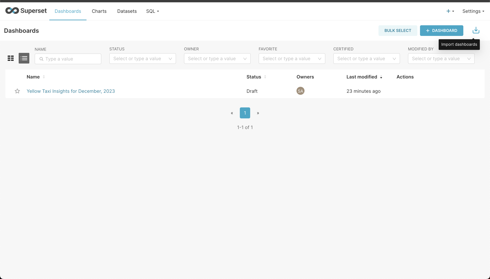

# Taxi Insights

## Project Overview

This project aims to extract, process, and visualize New York Yellow Taxi trip data for a specific month. The goal is to load cleaned data into a SQL database, perform aggregation, and create visualizations that provide insights into the total amount of passengers per day.

## System Requirements

- **Python Version:** ~=3.12.2
- **Package Manager:** ~=Poetry 1.8.2
- **Docker Engine:** ~=25.0.3, build 4debf41
- **Docker Compose:** ~=v2.24.6-desktop.1

This project has been tested On macOS 13.4 (22F66)

## Setup Instructions


### Install Python 3.12

Ensure Python 3.12 is installed on your system. If it's not, you can download it from the official Python website or use a version management tool like `pyenv`.


### Clone the Project

Clone the repository to your local machine using the following command:

```bash
git clone https://github.com/jmescalante2/taxi-insights.git
cd <project-root-directory>
```

### Install Poetry

Poetry is a tool for dependency management and packaging in Python. To install Poetry, follow the installation instructions on the [Poetry documentation page](https://python-poetry.org/docs/#installation). Make sure to activate your virtual environment first before the installation.

```bash
python3.12 -m venv .venv
source .venv/bin/activate
pip install -U pip setuptools
pip install poetry
```

### Install Dependencies from the Lock File
```bash
poetry install
```

### Launch Postgres and Superset
Start Docker then execute
```bash
docker-compose up -d
```

### Set up Superset (Only After the Container is Running)
1. Setup your local admin account
```bash
docker exec -it superset superset fab create-admin \
              --username admin \
              --firstname Superset \
              --lastname Admin \
              --email admin@superset.com \
              --password admin
```
2. Migrate local DB to latest
```bash
docker exec -it superset superset db upgrade
```
3. Set up roles
```bash
docker exec -it superset superset init
```

## Execution Instructions

### Run the Python Application
Run the application to create the postgres database and table, and populate the table with yellow taxi data from December, 2023.
```bash
poetry run app
```

### Launch Superset
Login and take a look: Navigate to http://localhost:8080

To replicate the dashboards using the exported dashboard data, follow the instructions below:
1. Check &lt;project-directory&gt;/data/dashboard_backup.zip
2. Navigate to the "import dashboards" button at the top-right corner under the Settings dropdown. 
3. Click the imported dashboard and you should see all the imported charts.


## Discussion
While it is possible to utilize PySpark for both processing and visualization, the task specifically requires loading the cleaned data into an SQL database. Given the relatively small size of the dataset — 3 million records with minimal concurrency requirements — even SQLite could suffice. Typically, in a production environment, the selection of a database and visualization tools involves multiple considerations such as business objectives, data analysis requirements, data access patterns, data models, the 5 Vs of data (Volume, Velocity, Variety, Veracity, and Value), performance, reliability, and scalability, as well as durability, to name just a few. Additionally, factors such as data sharing capabilities, security, integration, pricing, and licensing are crucial when choosing visualization tools.

For the sake of simplicity, I chose PostgreSQL and Apache Superset because they are open-source and can easily be replicated by the exam reviewer using Docker containers.

The most time-consuming part of this task was profiling the data for discrepancies and anomalies, particularly in the dates and location data, as well as cleaning them up and setting up the entire development environment.

There were also some assumptions necessary to proceed, such as treating all datetime data as if they were in UTC.

For this task, I adhered to using a single table, but for scalability, a more robust data model would be required, suitable for OLTP and/or OLAP systems.

Interestingly, the source file was already in Parquet format, which could easily be ingested into blob storage like Amazon S3, effectively serving as a data lake. This setup could then be directly queried by a serverless SQL service like Athena and visualized using various tools such as Tableau or Zoho Analytics, given their seamless integration with services like Amazon Athena.

In essence, there are myriad ways to tackle this project. However, I chose an approach that I believe most efficiently demonstrates my skill set.

## Outputs
### Yellow Taxi Insights for December, 2023


## Recommendations for Future Improvements
If given more time, we could

1. Data Expansion: Broaden the time span of the dataset to include a larger historical context, and integrate additional datasets to enrich the analysis and generate deeper insights.

2. Automated Data Validation: Introduce data contracts and implement automated checks to validate data integrity and accuracy systematically.

3. Script Parameterization: Implement argument parsing using argparse or leverage a more sophisticated configuration management tool like Pydantic, enabling more dynamic control over script parameters.

4. Containerization: Dockerize the Python processing application to mirror the containerized setup of PostgreSQL and Superset, fostering a more consistent and scalable development environment.

5. Automated Testing: Develop a suite of automated tests to ensure code reliability, functionality, and to facilitate continuous integration and deployment processes.

6. Code Quality Enhancement: Focus on refining the codebase to support extensibility and maintainability, reduce the occurrence of bugs, and improve collaborative efforts among developers.

7. Distributed Computing: Prepare for scaling data operations by adopting a distributed computing framework such as Apache Spark, which can handle increased data volumes and complex processing workloads efficiently.

